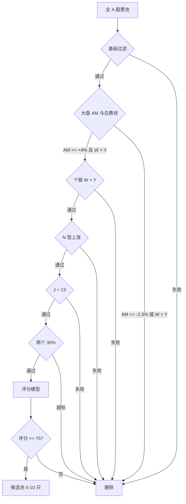

# B1 选股核心指南（量化改良版）

> 基于 Zettaranc A 股交易体系重建。本文把 B1 从“图形感觉”改成“硬门槛 + 评分模型 + 交易分支”，用于日常批量筛选、复盘和盘中执行。

---

## 一、定位

B1 建仓波不是抄底信号，而是**上涨 N 型结构回调末端的建仓信号**。

核心目标只有一个：在 A 股多头环境中，找到“主力已经建仓、洗盘接近尾声、止损很小、上方空间足够”的标的。

```text
错误用法：下跌趋势里找 J 值低点
正确用法：上涨趋势里等回调极致
```

---

## 二、字段定义

| 字段 | 含义 | 计算口径 |
|------|------|----------|
| `AM` | 活跃市值涨跌幅 | 市场择时指标 |
| `W` | 白线 | 短期趋势线 / BBI / 牵牛绳 |
| `Y` | 黄线 | 中期趋势线 / 大哥线 / 多空分界 |
| `J` | KDJ 的 J 值 | 日线或周线，按交易周期选择 |
| `RisePct` | 建仓波涨幅 | `(建仓波高点 - N 型起点) / N 型起点 * 100%` |
| `TurnoverSum` | 建仓波累计换手 | 建仓波内中阳 / 大阳线换手率累加 |
| `VolShock` | 异动放量 | 当日成交量 >= 前一日成交量 * 2 |
| `VolShrink` | 缩量程度 | B1 日成交量 / 近 20 日均量 |
| `Amp` | B1 日振幅 | `(最高价 - 最低价) / 昨收 * 100%` |
| `SupportDist` | 支撑距离 | `abs(收盘价 - 支撑位) / 支撑位 * 100%` |
| `RiskPct` | 计划止损幅度 | `(买入价 - 止损价) / 买入价 * 100%` |

中阳 / 大阳线建议用统一口径近似：

```text
中大阳 = 收盘价 > 开盘价 且 单日涨幅 >= 3%
涨停、放量长阳、假阴真阳反包都纳入统计
```

---

## 三、硬门槛

硬门槛用于第一轮淘汰。任何一项失败，直接放弃，不进入评分。

| 模块 | 必须满足 | 淘汰条件 |
|------|----------|----------|
| A 股基础过滤 | 非 ST / 非退市风险 / 非长期停牌 / 上市满 120 个交易日 | ST、退市风险、流动性异常 |
| 大盘择时 | `AM >= +4%` 或震荡偏多且大盘 `W > Y` | `AM <= -2.3%` 或大盘 `W < Y` |
| 个股趋势 | 个股 `W > Y`，且收盘价在 `Y` 上方或刚回踩 `Y` 后收回 | 个股 `W < Y`，黄线下方反弹 |
| N 型结构 | 最近两个有效波段高点抬高，低点抬高 | 下跌 N 型、横盘无序、A 杀后第一个企稳 |
| B1 触发 | 通用标准 `J < 13` | `J >= 13` |
| 两个 30% | 交易候选要求 `RisePct <= 40%` 且 `TurnoverSum <= 40%`；`RisePct` 在 `40%-50%` 只记录不交易 | `RisePct > 50%` 或 `TurnoverSum > 40%` |
| 风险收益 | `RiskPct <= 5%`，理想 `<= 3%` | 止损空间过大，盈亏比低于 3:1 |

> 最优 B1 用 `30% + 30%`，硬淘汰线用 `50% + 40%`。这样既保留知识库里“30%左右”的原意，也避免把 31% 的候选机械误杀。

---

## 四、B1 量化评分表

满分 100 分。硬门槛通过后再评分。

| 模块 | 权重 | 加分标准 |
|------|------|----------|
| 择时环境 | 15 | `AM >= +4%` 10 分；大盘 `W > Y` 5 分 |
| 周期趋势 | 15 | 个股 `W > Y` 6 分；收盘价在 `Y` 上方 4 分；周线白线之上或周线 N 型 5 分 |
| N 型结构 | 15 | 高点抬高 4 分；低点抬高 4 分；回调不破前低 4 分；结构清晰无长影乱飞 3 分 |
| 左半边建仓 | 15 | 底部出现 `VolShock` 5 分；放量阳线实体强 4 分；顶部缩量 / 无量 3 分；不是跳空孤量 3 分 |
| 右半边洗盘 | 15 | `VolShrink <= 0.6` 5 分；量能阶梯式或圆弧萎缩 4 分；B1 日 `Amp < 4%` 3 分；当日涨跌幅在 `-2% ~ +1.8%` 3 分 |
| B1 信号 | 10 | `J < 13` 4 分；`J < 0` 3 分；`J < -10` 3 分 |
| 两个 30% | 10 | `RisePct <= 30%` 5 分；`TurnoverSum <= 30%` 5 分 |
| 执行价值 | 5 | `RiskPct <= 3%` 3 分；上方空间 / 止损空间 >= 5:1 加 2 分 |

评级：

| 分数 | 结论 | 操作 |
|------|------|------|
| `>= 85` | A 级 B1 | 可进终选池，次日按量比执行 |
| `75-84` | B 级 B1 | 观察或半仓位试错，只做最强 |
| `65-74` | C 级 B1 | 仅记录，不主动交易 |
| `< 65` | 废 B1 | 删除，不解释 |

---

## 五、周期口径

不同交易对象不能混用同一套 B1 标准。

| 场景 | B1 周期 | J 值口径 | 趋势过滤 |
|------|---------|----------|----------|
| 主题 / 题材票 | 日线 B1 | `J < 13`，最好 `< 0` | 日线 `W > Y`，图形走在消息前 |
| 主线 / 龙头票 | 周线优先，日线辅助 | 周线 `J < 13` 或日周共振 | 周线 N 型 + 白线之上 |
| 少妇战法严格版 | 日线或周线 | `J < -10` | 风险极度厌恶，宁缺毋滥 |
| 波段战法 | 周线定方向，日线定买点 | 日线 `J < 13` 匹配周线趋势 | 周线 N 型 + 周线均线多头 |
| 超级 B1 | 标准 B1 失败后的再确认 | 大负值优先 | 等放量破位后缩量企稳，不抢第一根阴线 |

周线多头不要机械固定为 `10周 > 20周 > 30周`。更稳妥的量化口径：

```text
周线趋势合格 =
1. 周线 N 型高低点抬高
2. 周线收盘价在白线之上
3. 5/10/20/30 周线中至少 3 条均线走平或向上
```

---

## 六、结构量化

### 1. N 型识别

可以用近似算法把图形转成可筛选条件：

```text
最近 60 个交易日内：
H0 = 更早一个有效高点
P1 = 前一有效低点
H1 = 前一有效高点
P2 = 当前回调低点

合格条件：
H1 > H0
P2 > P1
当前收盘价 > P2
回调未跌破前 N 型低点
```

有效高低点可以用 5 日局部高低点近似：

```text
局部高点 = 当日最高价为前后各 2 日最高
局部低点 = 当日最低价为前后各 2 日最低
```

### 2. 左半边建仓

合格建仓波至少满足 2 项：

| 条件 | 量化标准 |
|------|----------|
| 放量异动 | `VolShock >= 2` |
| 有中大阳 | 建仓波内至少 1 根涨幅 `>= 3%` 的阳线 |
| 从低位启动 | 起涨点靠近 60 日线或前期平台下沿 |
| 不是一波流 | `RisePct <= 40%` |
| 顶部惜售 | 高点附近成交量低于左侧最大量的 `80%` |

### 3. 右半边洗盘

合格洗盘至少满足 3 项：

| 条件 | 量化标准 |
|------|----------|
| 缩量到位 | `VolShrink <= 0.6`，优秀 `<= 0.5` |
| 波动收敛 | B1 日 `Amp < 4%` |
| K 线安静 | 小阴小阳为主，单日涨跌幅多数在 `-2% ~ +2%` |
| 回踩支撑 | `SupportDist <= 3%` |
| J 值到位 | 通用 `J < 13`，保守 `J < -10` |

---

## 七、两个 30% 的执行口径

| 指标 | 最优 | 警戒 | 淘汰 |
|------|------|------|------|
| `RisePct` | `<= 30%` | `30%-40%` | `> 50%` |
| `TurnoverSum` | `<= 30%` | `30%-40%` | `> 40%` |

判定逻辑：

```text
RisePct <= 30% 且 TurnoverSum <= 30%：
  真 B1 优先级最高

任一指标处于 30%-40%：
  降一档，只能在择时强、图形极美、量比强时参与

RisePct > 50% 或 TurnoverSum > 40%：
  视为出货波 / 一波流，放弃
```

---

## 八、盘前批量筛选流程



盘前候选池只保留 5-10 只。A 股票多，不需要自我说服。

---

## 九、次日量比执行

B1 当天只负责确认图形，次日用量比确认资金。

| 次日开盘条件 | 判断 | 动作 |
|--------------|------|------|
| `量比 > 20` 且红盘 / 高开不离谱 | 主力急迫 | 可按计划仓位执行 |
| `量比 10-20` | 有资金但未极强 | 半仓位，贴均线或等分时确认 |
| `量比 > 10` 且低开不超过 `-2%` | 可能假弱转强 | 观察承接，翻红再考虑 |
| `量比 < 10` | 无量无势 | 不追，等回踩 |
| 开盘急拉 30 秒内 6%+ | 高风险诱多 | 不追，等 5-10 分钟确认 |

仓位建议：

```text
A 级 B1：1 个计划单位
B 级 B1：0.5 个计划单位
C 级 B1：不交易
单票首仓建议 <= 总资金 10%
```

---

## 十、止损与持仓

买入前必须先算 `RiskPct`，不能买完再找理由。

| 止损线 | 量化口径 | 优先级 |
|--------|----------|--------|
| 买入 K 线最低点 | 最低点下方 3-5 个价位，或 `1%-3%` | 第一止损 |
| 前 N 型低点 | 跌破前一个有效低点 | 结构止损 |
| 黄线 | 跌破且收不回 | 最终止损 |

持仓纪律：

```text
买入后 3 天内必须恢复上涨
3 天不涨但没大跌，最多再看 1-2 天
跌穿止损，全卖
上涨后跌回成本，至少减半
```

交易价值要求：

```text
最低盈亏比：3:1
理想盈亏比：5:1 以上
完美 B1 目标：止损 3% 内，潜在空间 15%-30%+
```

---

## 十一、废 B1 清单

以下情况即使 `J < 13` 也不做：

- 大盘 `AM <= -2.3%`
- 大盘或个股 `W < Y`
- 下跌趋势中的反弹
- 横盘无序、长上下影线乱飞
- A 杀后的第一个企稳
- 建仓波从底部已涨 `75%+`
- `RisePct > 50%`
- `TurnoverSum > 40%`
- 高位放量上影线
- 连续堆量但股价滞涨
- 跳空孤量后没有后续承接
- 止损空间超过 `5%`

---

## 十二、最终检查单

```text
一、硬门槛
[ ] 非 ST / 非退市风险 / 上市满 120 个交易日
[ ] AM >= +4%，或至少震荡偏多
[ ] 大盘 W > Y
[ ] 个股 W > Y
[ ] N 型上涨结构成立
[ ] J < 13
[ ] RisePct <= 40%
[ ] TurnoverSum <= 40%
[ ] RiskPct <= 5%

二、优选条件
[ ] J < 0，最好 J < -10
[ ] RisePct <= 30%
[ ] TurnoverSum <= 30%
[ ] 左半边有 VolShock
[ ] 右半边 VolShrink <= 0.6
[ ] B1 日 Amp < 4%
[ ] B1 日涨跌幅在 -2% 到 +1.8%
[ ] SupportDist <= 3%
[ ] 上方空间 / 止损空间 >= 5:1

三、执行条件
[ ] 次日量比 >= 10
[ ] 最强候选优先，不强就换
[ ] 买入前已写好止损价
[ ] 3 天不涨有退出计划
```

---

## 十三、关联概念

| 概念 | 用途 |
|------|------|
| [[活跃市值]] | 大盘择时硬门槛 |
| [[白线黄线系统]] | 大盘与个股趋势过滤 |
| [[知行趋势线]] | 白上黄上 + B1 的趋势组合 |
| [[N型结构]] | 判断是否只做上涨趋势 |
| [[B1建仓波]] | B1 基础定义 |
| [[B1完美图]] | 高胜率图形模板 |
| [[两个30%原则]] | 区分建仓波与出货波 |
| [[量比战法]] | B1 次日执行 |
| [[异动选股法]] | 左半边建仓识别 |
| [[倍量柱]] | 放量异动量化 |
| [[暴力K]] | 完美 B1 的左侧增强信号 |
| [[筹码三段论]] | 筹码集中验证 |
| [[少妇战法]] | 保守版 B1 SOP |
| [[波段战法关键7步]] | 周线定方向、日线定买点 |

---

## 十四、核心原则

```text
先择时，再选股，再等 B1，再看量比，再执行止损。
```

B1 不是每日任务。A 股 5000 多只票，合格的才看，不合格的删除。

*本文仅供学习研究，不构成投资建议。*
